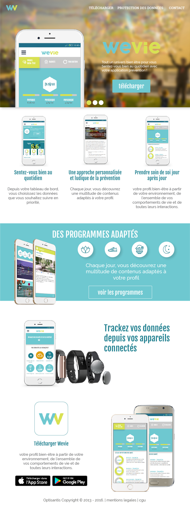

# le maquettage
> après toutes les étapes de recherches et de réflexion effectués en amont cette partie doit retranscrire/traduire leur conclusion de façons graphique et fidel au site final.

---

## conception des interfaces
Le maquettage vient en général après le wireframing (rappel).  
Elle permet de partager la vision du designer au reste de l'equipe.  
Cette étapes est suivie du prototypage contenant des mockups.  
