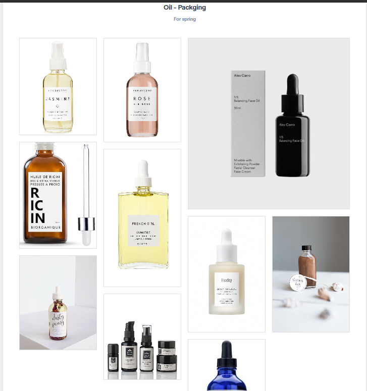
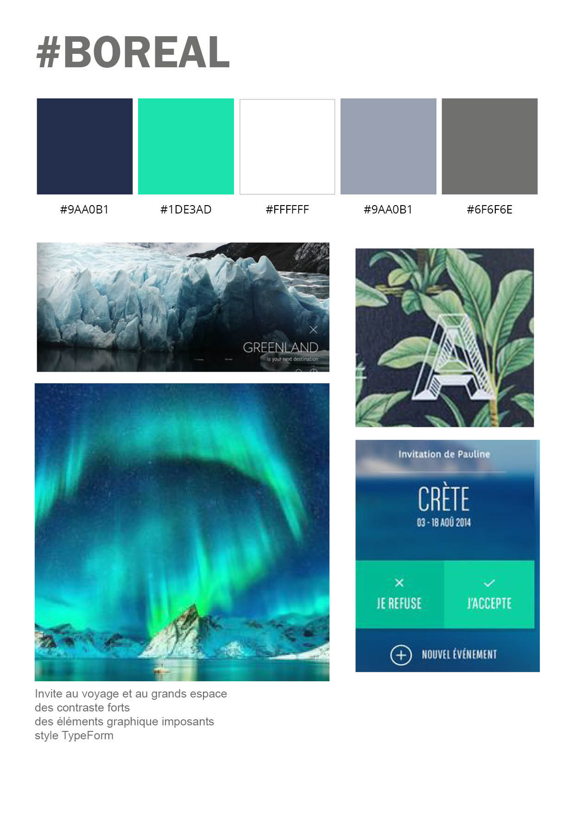
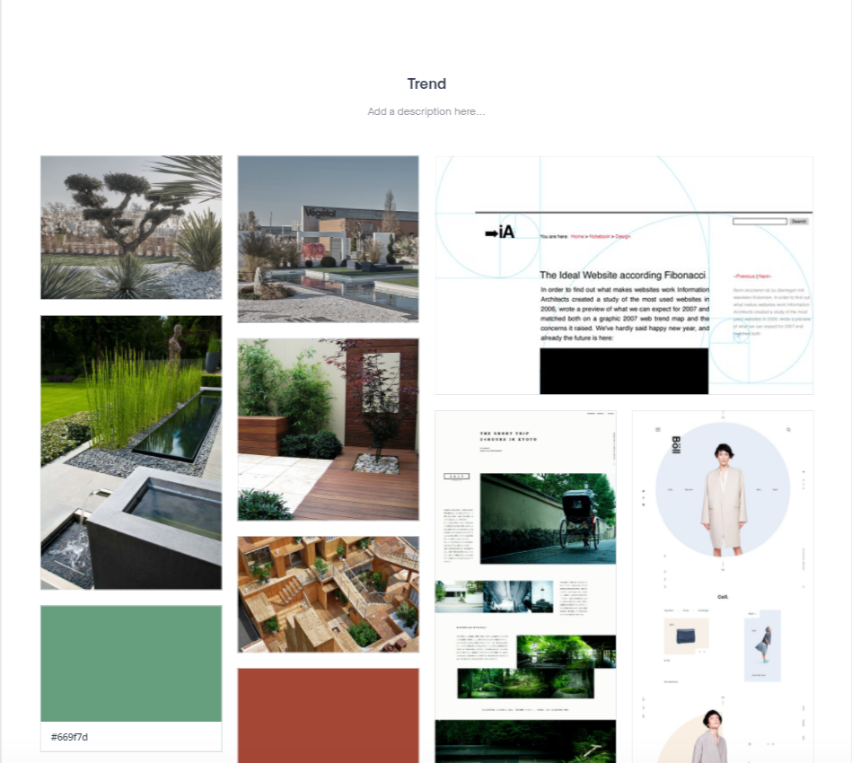

# La Veille concurrentielle

La recherche est l'une des étapes clés une fois que le cahier des charge est fixée

##  Planche contact - planche tendance

Pour permettre d'avoir une visualisation général d'un univers il est nécessaire de créer de répertorier les **inspiration** sur les quels on pourra se baser dans le futur.

## carte perceptuelle
permet de definir des axes de recherche pour pouvoir commencer les croquis de wireframe, maquettages