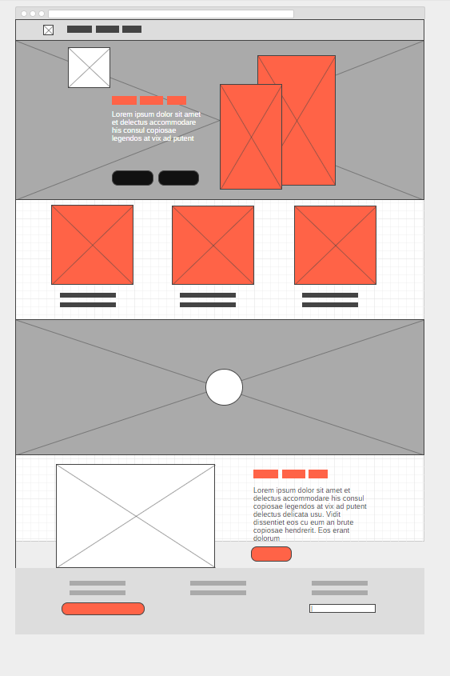
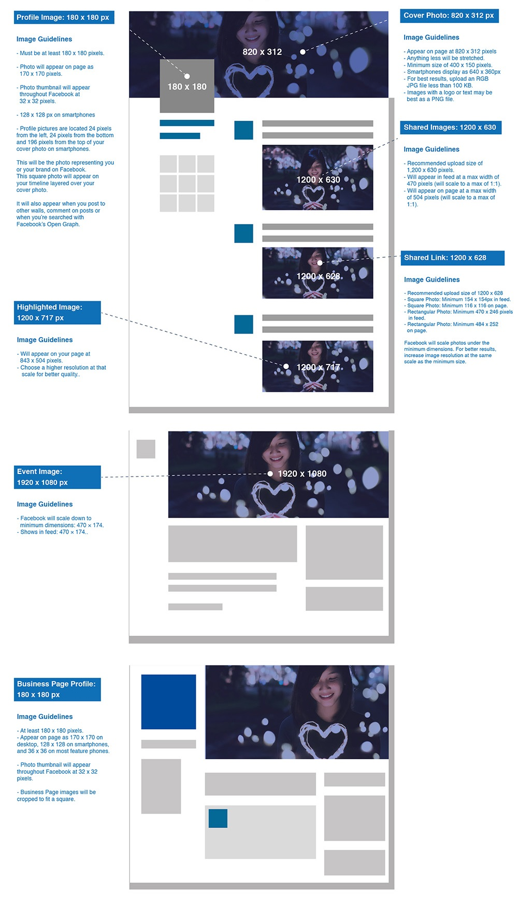
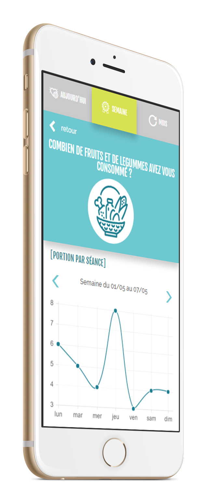

# Webdesign ou conception de site web
> La conception et la production de sites web ou web design est la réalisation  de l'interface web : l’architecture interactionnelle, l’organisation des pages, l’arborescence et la navigation dans un site web. La conception d'un design web tient compte des contraintes spécifiques du support Internet, notamment en termes d’ergonomie, d’utilisabilité et d’accessibilité. [wikipedia](https://fr.wikipedia.org/wiki/Conception_de_site_web)ion de l'interface web : l’architecture interactionnelle, l’organisation des pages, l’arborescence et la navigation dans un site web. La conception d'un design web tient compte des contraintes spécifiques du support Internet, notamment en termes d’ergonomie, d’utilisabilité et d’accessibilité. [wikipedia](https://fr.wikipedia.org/wiki/Conception_de_site_web)

---

1. ## le Cahier des charges
Un cahier des charges est un document qui permet de comprendre et d’expliquer un projet dans son ensemble. Il contient toutes les contraintes, les besoins, les objectifs ou encore les intervenants qui y sont liés. En d’autres termes, un cahier des charges est la base pour pouvoir concevoir de A à Z votre projet technique, sans rien oublier et en indiquant tous les éléments qui devront être pris en compte. Sans ce document, toute conception de site Internet risque d’aboutir à un échec total.[REF](https://www.seomix.fr/cahier-des-charges-web/)

2. ## La veille concurentielle
La veille n'est pas une specicificité du travail du designer,  on trouve une nécessité à cette pratique dans plusieurs metiers comme le développement web. Mais en réalité là où une pratique porte un nom technique, dans la vie courante on le fait déjà:
- quand on compart les nouveaux processeurs ou consoles sur le marché
- quand on regarde les tendances de la mode
- quand on se cré un un bookmak sur un sujet particulier.

> la veille permet de se tenir au courant des nouveauté

- [pinterest](https://www.pinterest.fr/)
- [invision](https://projects.invisionapp.com/boards/5X3O0VV68RE/)

3. ## Arborescence et wireframe
Depuis le CDC on peut en général extraire l'architecture interractionnelle entre les pages (arborescence) à partir de là et il possible. Faire l'arborescence permet d'avoir une vue général du fonctionnement du site.

Quand on a une idée surtout pour un site/app il est difficile de la produire rapidement, il est donc necesssaire d'en sortir les **concepts généraux**.
On peut faire des wireframes à la main (rien vaut le bon vieux crayon et le carnet pour eviter CTRL+z) mais on peut semparer d'un outils comme :
- [wireframe.cc](https://wireframe.cc/?ref=blogduwebdesign.com)

4. ## maquettage
C'est l'étape "finale" de la partie création, où l'on élabore la partie du design. Le résultat doit être validé (après choix possible entre plusieurs versions/déclinaison) . C'est à partir de ce final que l'on pourra effectuer des [mockup](/outils/GLOSSARY.md#mock-up), des proto et l'integration.
Quand ont founit les fichiers prour l'intégration il faut joindre :
- les specifications
- fonts
- les images pour les devices
- les couleurs (pantone, hexa, rvb et cmjn)
- kit graphique (boutons, souris hover, pictogrammes)

5. ## mockup
<!---->

il ne faut pas confondre wireframe et mockup, le mockup sert à mettre en abime le produit dans sont usage. On peu t faire un mockup d'un visuel qui ira sur un mug, un tshirt mais aussi d'un page internet. Là où l'on peut en voir c'est sur le play store pour présenter les apps.
- [mockup en ligne](https://mockupbro.com/)

6. ## Prototypage
le prototypage, comme son nom l'indique est un [prototype](/outils/GLOSSARY.md#prototype), on peut en produire au wireframe pour comprendre le concept d'interaction et ainsi une meilleure projection au niveau UX, mais il très conseillé d'en faire lorsque le maquettage est fini ça permet au intervenant venant après le designer de comprendre le fonctionnement du site.
[invision](http://invision.com)