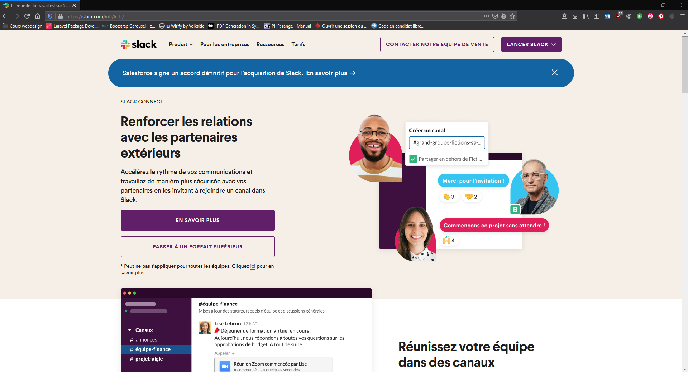
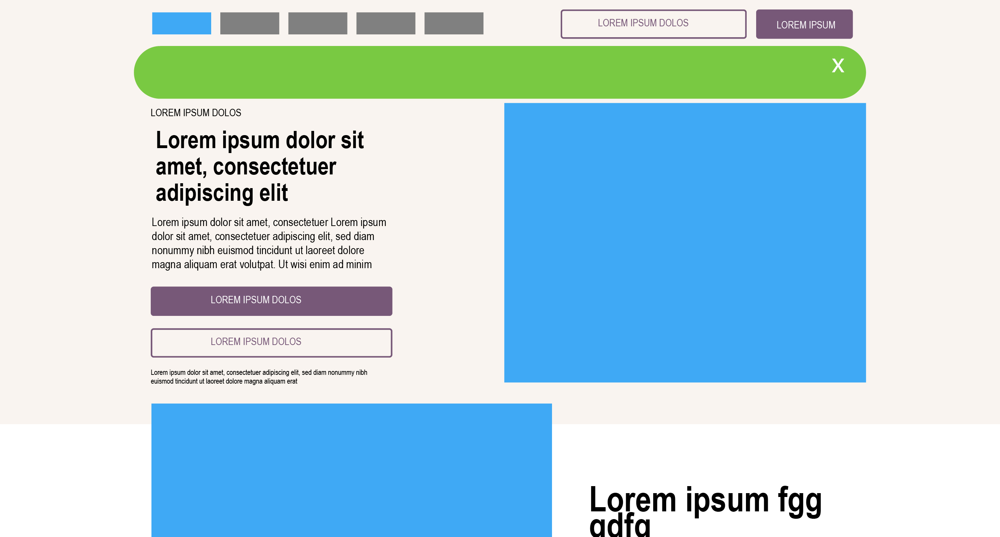
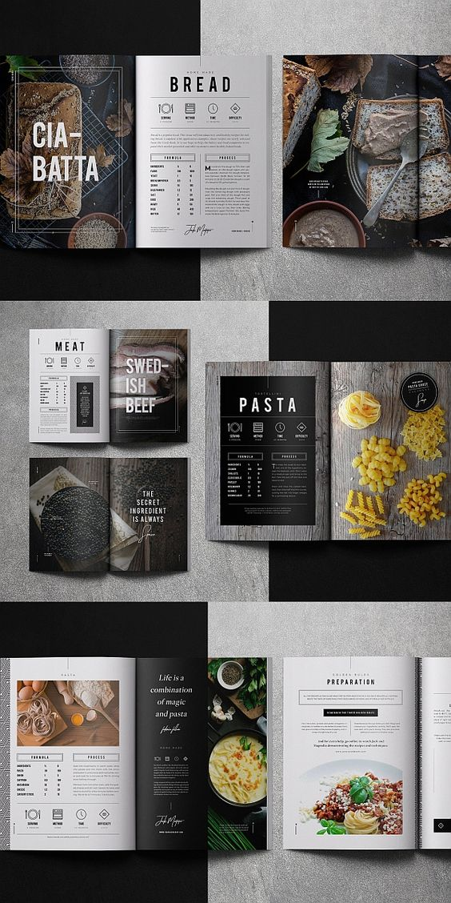

# prise en main illustrator
---

- [grille 12 colonnes](https://www.loom.com/share/0762cd7f48fd4482b2f7c74f84e8b0b1)
- [export format AI -> JPG && AI -> PSD](https://www.loom.com/share/01874e5555664400a8886a324989d4ba?sharedAppSource=personal_library)

## les images vectorielles et leur usages
- [export multiples pour pictogrammes pour le web](https://www.loom.com/share/f3444deaeb184f028ec0438b80a90683?sharedAppSource=personal_library)

Lorsque que l'on produit des médias pour le web (en particuler) il faut se poser en premier lieu dans quel cadre sera utilisé ces fichiers (voir le chapitre sur les image).
Après avoir déterminer ce cadre: support, usages etc on peut choisir le format de sortie.

## zonning

- [wireframe/zonning page slack](https://www.loom.com/share/b1d9b58c2aaf4ff387a4463860049a64)  
- [zonning & positionnement](https://www.loom.com/share/b1d9b58c2aaf4ff387a4463860049a64)

## templating
  

- [pizza maquette 1](https://www.loom.com/share/7ba63b4f710d4f8aa4924fadcc9d3285)  
	
- [maquettage PIZZA : creer un tableau et utiliser les repères](https://www.loom.com/share/31375481eb994875bac2d23983381ec0?sharedAppSource=personal_library)  

