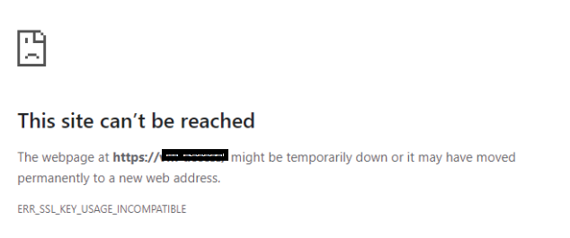

# Laragon configuration
> error de ssl sur les navigateurs utlisant Chromium *Opera, Edge, Chrome*

la [solution] est assez facile
- activer le ssl de ngnix : clic droit sur laragon > ngnix et SSL enabled
- il faut modifier le fichier /etc/openssl.com  
- ouvrir le termimal dams le /etc/dossier