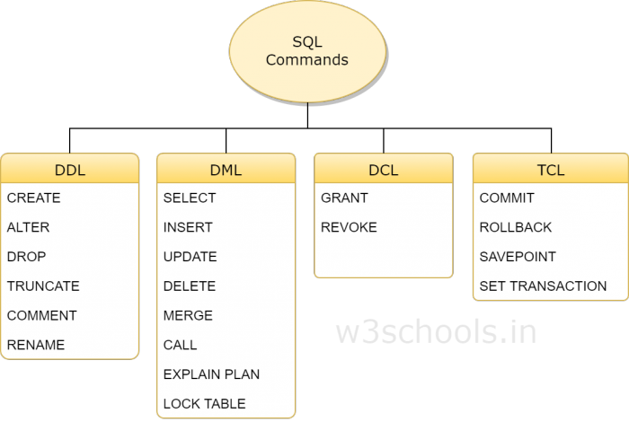

#Base de données et structures, NOTIONS

### WAMP/MAMP/LAMP/XAMP ==
 -  STACK (pile) pour eviter les pbs sur WINDOWS installer la version 32bits

Pour optimiser le serveur pour prendre plus de place, pour que 'exécustion soit plus rapide et alouer plus de mémoire aux données (cache, retc...)


[VOIR](https://fsmrel.developpez.com/basesrelationnelles/workbench/?page=7)
[w3cshool](https://www.w3schools.in/mysql/ddl-dml-dcl/)
 - MLD Modèle logique de données(précedents) [mld hocClassroom blog](hoclassroom/MldMysqlWorkbench.md)
 - dictionnaire des données
 - MCD Modèle conceptuel de données
 
###  Les types de commandes SQL (DDL, DML)

 1. ddl defininir un element de structure 
    > DDL is short name of Data Definition Language, which deals with database schemas and descriptions, of how the data should reside in the database. 
    - CREATE - to create database and its objects like (table, index, views, store procedure, function, and triggers)
    - ALTER - alters the structure of the existing database
    - DROP - delete objects from the database
    - TRUNCATE - remove all records from a table, including all spaces allocated for the records are removed
    - COMMENT - add comments to the data dictionary
    - RENAME - rename an object
    
 2. dml
    > DML is short name of Data Manipulation Language which deals with data manipulation and includes most common SQL statements such SELECT, INSERT, UPDATE, DELETE etc, and it is used to store, modify, retrieve, delete and update data in a database. 
     - SELECT - retrieve data from a database
     - INSERT - insert data into a table
     - UPDATE - updates existing data within a table
     - DELETE - Delete all records from a database table
     - MERGE - UPSERT operation (insert or update)
     - CALL - call a PL/SQL or Java subprogram
     - EXPLAIN PLAN - interpretation of the data access path
     - LOCK TABLE - concurrency Contr
     
 3. dcl (data control language)
    > DCL is short name of Data Control Language which includes commands such as GRANT and mostly concerned with rights, permissions and other controls of the database system. 
 déclarations de DCL contrôlent le niveau d`accès que les utilisateurs ont sur les objets de base de données. 
 
    - SUBVENTION - permet aux utilisateurs de lire / écrire sur certains objets de base de données 
    - RÉVOQUER - empêche les utilisateurs de l`autorisation de lecture / écriture sur les objets de base de données
    - GRANT - allow users access privileges to database
    - REVOKE - withdraw users access privileges given by using the GRANT command
    
 4. TCL
    > is short name of Transaction Control Language which deals with a transaction within a database.    
    - COMMIT - commits a Transaction
    - ROLLBACK - rollback a transaction in case of any error occurs
    - SAVEPOINT - to rollback the transaction making points within groups
    - SET TRANSACTION - specify characteristics of the transaction
     
     
 


 - SGBDR (System de Gestion de Bases de Données Relationnelles):

 

Server
|>
BDD
     |>
     TABLE     -> users / produit / article /  catégorie     -> COLONNES ( nom | prenom | age etc)

exemples de relations:

    "j'ai une école avec des classes contiennent des élèves;
    j'ai des professeurs;
    un professeur enseigne à une classe"

### FORMES NORMALES
> permet de structurer les données et ne pas faire d'erreurs => il y a plusieurs sorte de formes normal. C'est un niveau de complexité de structuration;

Normalisation de schémas:

###1. Une information Atomique (1NF),
**elle ne peut être divisée par son information** ctd que le Niveau d'une classe ou l'age d'un élève n'est pas divisible alors que professeurs ou matières ne sont pas des infos unique que l'on ne peut diviser.

###Relations:
- ECOLE == Professeurs + classes
- professeur -> classe
- classe <- professeur

    * classe :  nb eleves, niveau, professeur, filles, garcons, nom, matières, identifiant(unique INT auto incrémentation)
    * professeur :  nom, prenomn matière, classe, date de naissance, adresse, , identifiant(unique INT auto incrémentation)
    * eleve: nom, prenom, date de naissance, classe, niveau, adresse, genre, inscrit cantine, identifiant(unique INT auto incrémentation)
    * matiere:  nom (html css, javascript, graphisme, base de donnée, php, java, mobile, softskills)
    * telephone : numero ,
    * email: adresse,
    * type_email:
    * allergie :  alimentaire,


###2. Dépendance fonctionnelles DF (2NF),
à partir d'une information, j'ai accès à d'autres informations;
> [propriété de départ]-> (donner accès à d'autres propriétés) -> [propiété d'arriver]
- UUID : exemple -> clef wifi sous la forme e5656-10f45...
- ou CLEF PRIMAIRE -> chaque classe a une valeur de clef unique, elle permet de définir de façon claire et précise
- CLEF PRIMAIRE COMPOSITE :   il y a plusieurs champs (plusieurs identifiants),
- CLEF ETRANGERES

###3. 3NF (non indispensable)
>elle ressemble à la 2eme mais à l'inverse:  on ne doit pas déduire le résultat d'un champs par l’addition de plusieurs autres champs;
- Selon les besoins des requêtes -> si une requêtes est souvent appelée on peut écraser la 3NF ()
- Lors de la création d'une table on peu créer une clef primaire exemple dans une table de VILLES avec des noms de ville et en valeur primaires 1

### dictionnaire des données
- N: numérique
- A: Alpha/string
- AN: AlphaNumerique
- B: Booléen (true./false 0/1)

se construit sous une forme de tableau

### MCD Modèle conceptuel de données
Comment on va concevoir la base de données , pour identifier visuellement les entités

    | CLASSE
    ---
    | classe_id
    | niveau
    | nom

    | PROFESSEUR
    ---
    | prof_id
    | nom
    | prenom
    | datedenaissance
    
    | ELEVE
    ---
    | eleve_id
    | nom
    | prenom
    | adresse
    | datenaissance


   - ELEVE ->(1,1) ETUDIER DANS (1,N) -> CLASSE
   -  PROFESSEUR -> (1,1) (un professeur a une seule classe) ENSEIGNER (1,N) (une classe a plusieur professeur)-> CLASSE
        * ou PROFESSEUR -> (1,1) (un professeur a une seule classe) ENSEIGNER + DATE ARRIVER (1,N) (une classe a plusieur professeur)-> CLASSE ==> DF de prof_id, class_id -> DATE ARRIVER  ( elle créera / déduira une nouvelle table dateArrivé)


------

ennoncé
- un prod :
    * nom (pk)
    * prix
    * visuel
    * plusieurs catégories
- categories:
    * nom
    * plusieurs produits 
    * date (cle etrangere)> produit
- système de produits similaires, qui permette d'associer des produits entre eux pour pouvoir les porposer une même page
- un degré dde similarité entre 2 produits

----

## WAMP
> min param MYSQL == v 5.7
#### réinitialiser mot de passe root Mysql
dans un fichier `mysql-init.txt`
```
    ALTER USER 'root'@'localhost' IDENTIFIED BY 'MyNewPass';
    SET PASSWORD FOR 'root'@'localhost' = PASSWORD('MyNewPass);
```
```
    C:\> cd "C:\Program Files\MySQL\MySQL Server 5.7\bin"
    C:\> mysqld --init-file=C:\\mysql-init.txt
```


## 4 jointures differentes en SQL

- (INNER) JOIN:   
Retourne les valeurs correspondantes/matchs dans les deux tables

 
- LEFT (OUTER) JOIN: Return all records from the left table, and the matched records from the right table
 

- RIGHT (OUTER) JOIN:    
Retoune toutes les éléments de la table de droite qui ont des valeurs/colonnes qui correspondent à la table de gauche  mais aussi celles qui ne match pas / correspondent pas à la table de gauche
 

- FULL (OUTER) JOIN:
Retourne toutes les correspondance qui matchent dans l'une ou l'autre des table de gauche et de droite
 
 