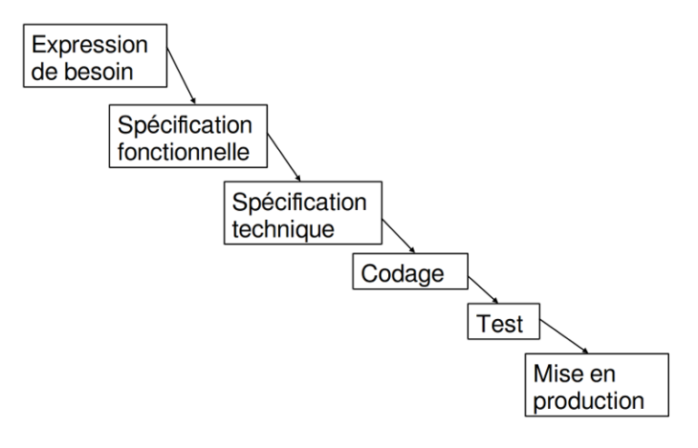
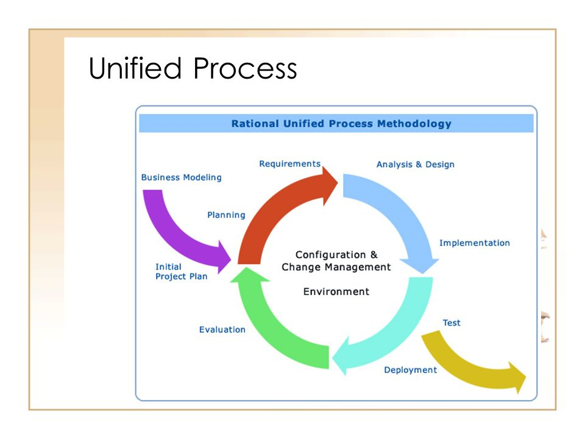
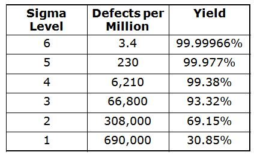
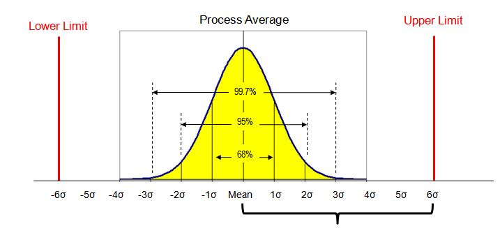

# Gestion de projet :  Agiles - Scrum

## PERT

## CHEMIN CRITIQUE
Elle se base sur le diagramme de PERT.
cette méthode évalue les étapes indispensables aux projets et celle non prioriaites
Le principe est linéaires par rapports à ces étapes indispensabbles que l'on appel `taches critiques`

## CASCADE
> elle suis un systeme d'exécutions des taches linéaires c'est à dire que chaque taches est effectuées les unes après les autres
-       CDC -> lancement -> livraison
- Emploi dans le BTP car le processus de construction est linéaire (ex : les façades se montent avant le toit et les fondations avant les façades etc...) institué depuis les année 1970 par Winston W. Royce
plus d'inconvénients que d'avantages
* deception du client
* nbx imprévus
* gènère du retards
* gènère des coûts supplémentaires

elle a été versionnée vers le modèle `méthode en V`, qui est dirigé par les tests à chaque jalons

## PROCESSUS UNIFIES
> Elle permet de mettre en avant l'architecture générale et les différentes itérations /  incrémentations à prévoir dans le projet qui va s'appliquer sur les cas d'utilisations qui se divise, eux même en besoins ftlles et non ftlles
 le PU (UP en anglais) se base sur les tests.

- Parente du RUP ( Rational Objectory Proces) depuis 1997 basée sur l'approche d'Ericsson (entreprise suédoise) qui inclue des diagrammes séquentiels.

voir la presentation (c'est largement suffisant)

## SIX SIGMAS
se base sur le DMAICS (schemas pyramidale)
> La lettre grecque sigma σ correspond à l’écart type, et rappelons que l’écart type est la racine carrée de la variance au sens mathématique. Donc « Six sigma » est 6 fois l’écart type. L’écart type peut être assimilé à la dispersion d’un processus

si l'ecartd se situe en -6 & 6 alors on se statue dans les clous du projet

