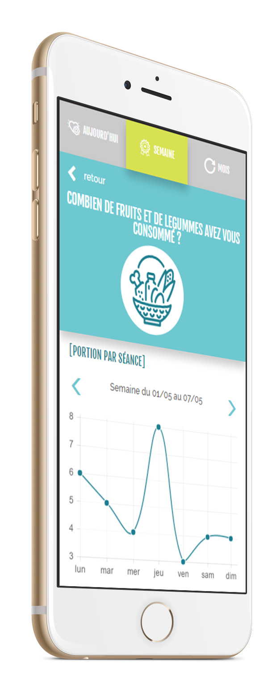

# Veille, études de la concurence, recherches, maquettage,  et integration

## La veille concurentielle
La veille n'est pas une specicificité du travail du designer,  on trouve une nécessité à cette pratique fans plusieurs metier comme le developpement. Mais en réalité là où une pratique à porte un nom dans la vie courante on le fait :
- quand on compart les nouveaux processeurs ou consoles sur le marché
- quand on recgarde les tendance de la mode

> la veille permet de se tenir au courant des nouveauté

- [pinterest](https://www.pinterest.fr/)
- [invision](https://projects.invisionapp.com/boards/5X3O0VV68RE/)

## wireframe
  
Quand on a une idée surtout pour un site/app il est difficile de la produire rapidement, il est donc necesssaire d'en sortir les **concepts généraux**.
On peut faire des wireframes à la main (rien vaut le bon vieux crayon et le carnet pour eviter CTRL+z) mais on peut semparer d'un outils comme :
- [wireframe.cc](https://wireframe.cc/?ref=blogduwebdesign.com)

## maquettage
C'est l'étape "finale" de la partie création, où l'on elabore la partie du design. Le résultat doit être validé (après choix possible entre plusieurs version) . C'est à partir de ce final que l'on pourra effucter des mockup, des proto et l'integration.
Quand ont founit les fichiers prour l'intégration il faut joindre :
- les specifications
- fonts
- les images pour les devices
- les couleurs (pantone, hexa, rvb et cmjn)
- kit graphique (boutons, souris hover, pictogrammes)

## mockup
  
il ne faut pas confondre wireframe et mockup, le mockup sert à mettre en abime le produit dans sont usage. On peu t faire un mockup d'un visuel qui ira sur un mug, un tshirt mais aussi d'un page internet. Là où l'on peut en voir c'est sur le play store pour présenter les apps.
- [mockup en ligne](https://mockupbro.com/)

## Prototypage
le prototypage, comme son nom l'indique est un prototype, on peut en produire au wrieframig pour comprendre le concept d'interaction et aisni une meilleur proection au niveau UX, mais il trèsconseillé d'en faire lorsque le mauettage est fini ça permet au intervenant venant après le designer de comprendre le fonctionnement du site .
