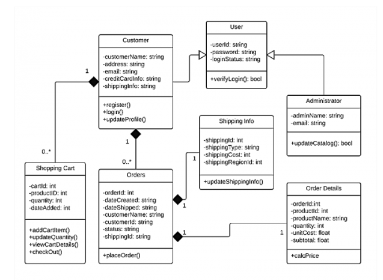
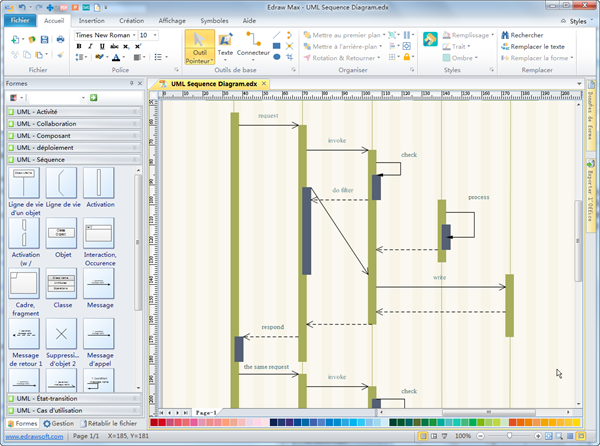

# Java & UML

### Uml [wiki]('https://fr.wikipedia.org/wiki/Diagramme_de_classes')
description de la manière dont marche un programme

### diagramme de classe
Une classe est représentée par un rectangle séparé en trois parties :
- la première partie contient le nom de la classe
- la seconde contient les attributs de la classe
- la dernière contient les méthodes de la classe
La seconde et la dernière représentent le comportement de la classe.

### relations entre classe

> voir la doc de Jeremie Deruette

c'est la mnière dont les classe inter-réagissent
- hértitage
- association
- agregartion
à l'inverse de Merise les relations sont inversé Origin -> source

ce schema est lu de de cette manière :
    Admin -> herite -> User
    Customer > herite -> User

    Shopping cart 0..* ->  possède 1 -> Customer
    Customer 1 ->  possède 0 ou * -> Shopping cart

schemas de cas d'utilisations (app-logiciel) - peut être utilisaer pour mieux comprendre le fonctionnement selon l'utilisateur de l'app
il est en général utilisé si l'on fait de l'uml

# diagramme de séquence
lucidchart

