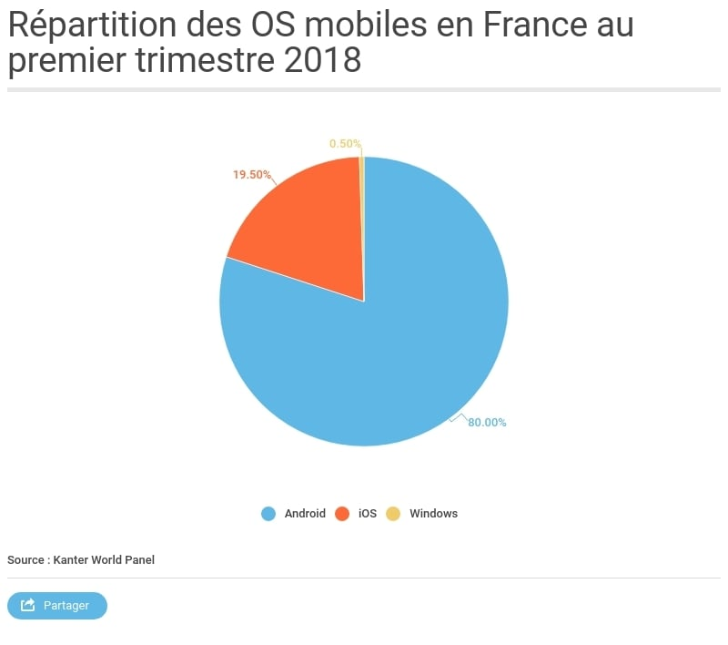
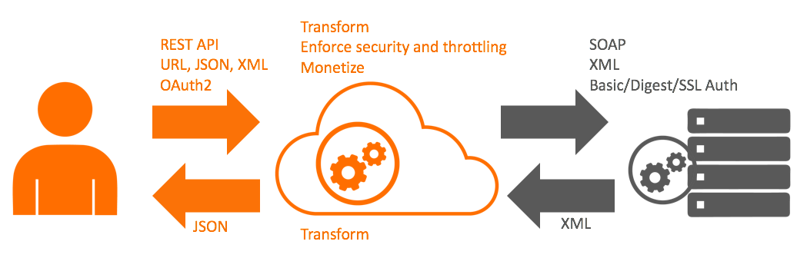

# dev mobile

### historique
- 1830 morse
- 1984 IBM simon > premier smartphone
- 1992 premier mobile sur le marché
- 2017 premier Iphone Apple

### repartition des trafic web sur les support en % en 2017
   - 43.4 % desktop
   - 51.4 % phone
   - 4.9 % tablette
   - 0.13 % console
    
en dec 2016 81% des personnes avait un smartpohne

### apple
- apport du app store
- 2010 gestion de multitaches en fond

Apple met à disposition des devs les versions BETA mais ne cela ne permet pas revenir sur une version realease sauf si la BETA que l'on utilise pas en Realese

### SUPPORT OS
- ios
- android
- cyanogenMod

### SOAP & REST [ref](https://www.lemagit.fr/conseil/SOAP-ou-REST-comment-bien-choisir)
protocole de communication qui permet d' accéder à des services Web

1. rest (Representational State Transfer) [mdn](https://developer.mozilla.org/fr/docs/Glossaire/REST)
== via navigateur, port 80 - RESTful 
    #### Les services Web
    > Globalement, un service Web est une méthode de communication entre deux applications ou appareils électroniques, via le Web. Il existe deux types de services Web: Simple Object Access Protocol (SOAP) et Representational State Transfer (REST).
    
    CLIENT -[htpps - ROUTE] -> SERVEUR   
    CLIENT <-[json] - SERVEUR 
    
    GET  
    POST -> new  
    PUT -> modifier  
    DELETE -> supprimer
    
    - sait utiliser un protocole et des méthodes standardisées. Son application doit rentrer dans ce modèle. On ne crée pas de méthodes supplémentaires, on utilise les méthodes standardisées que l'on développe pour le type de media dont on a besoin. Il y a en conséquence beaucoup moins de couplage entre le client et le serveur : un client peut utiliser un service de type REST sans aucune connaissance de l'API
        - est indépendant d'un protocole
        
        - protocole HTTP (tant qu'il s'agit d'un protocole possédant un schéma standard pour une URI):
            - l'authentification 
            - ou encore la sécurité seront standardisées
        - protocole FTP (tant qu'il s'agit d'un protocole possédant un schéma standard pour une URI)
        - SMPT 
    - Application RESTful:
        - le client ne doit connaître que le point d'entrée de l'API 
        - le type de données qui est attendu.
    
    
Les API fournissant une documentation complète avec les schémas d'URL ne sont donc pas RESTful,
2. soap ( Object Access Protocol)
== include
 >  est une spécification d’un protocole de communication standard (un ensemble de règles) pour l’ échange de messages XML. SOAP repose sur différents protocoles de transport, tels que HTTP et SMTP. L’usage du protocole standard HTTP permet au modèle SOAP de passer les paresseux et les proxies sans avoir à modifier le protocole. SOAP peut parfois être plus lent que des technologies middleware, comme CORBA ou ICE, à cause notamment du coté verbeux du format XML.
 
 - Un client développé avec le protocole SOAP ressemble à un logiciel d'ordinateur, car il est étroitement lié au serveur. Si une modification est effectuée d'un côté ou de l'autre, l'ensemble peut ne plus fonctionner. Il faut effectuer des mises à jour du client s'il y a des changements sur le serveur et vice-versa.n client développé avec le protocole SOAP ressemble à un logiciel d'ordinateur
 - un client SOAP doit tout savoir des éléments qu'il va utiliser pendant son interaction avec le serveur, sinon cela ne fonctionnera pas.

Pour la sortie

### APPROCHES
1. Native
 
    - native UX
    - composant
    - notif 
    - geoloc
    - connectivité objet co
    - RAPID & EFFICACE
    - mais développement sur les deux os IOS/ANDROID

2. Hybridre
    - pas de swift / objective-c
    - on peut switcher directement sur du natif

3. WEB
    - prototype
    - ou appli web (facebook)
    - Pas chouette
    - gain de temps
    - peu de budget
     

### FRAMEWORKS
swift / objective-c / java andro / .NET     
 
phoneGap (adobe)/ cORDOBVA  / IONIC (angular)-> html encapsulé dans un cadre natif == UX NULL > lent 
     - multiplatform
    
REACT NATIV (reactJs)/ xamarin / nativeScript 
UX
multiplatform
on peu basculer en natif

### open data [données public bdd](https://www.data.gouv.fr/fr/)